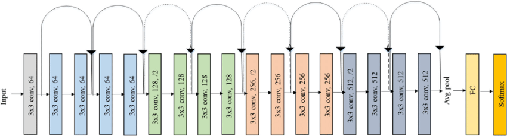
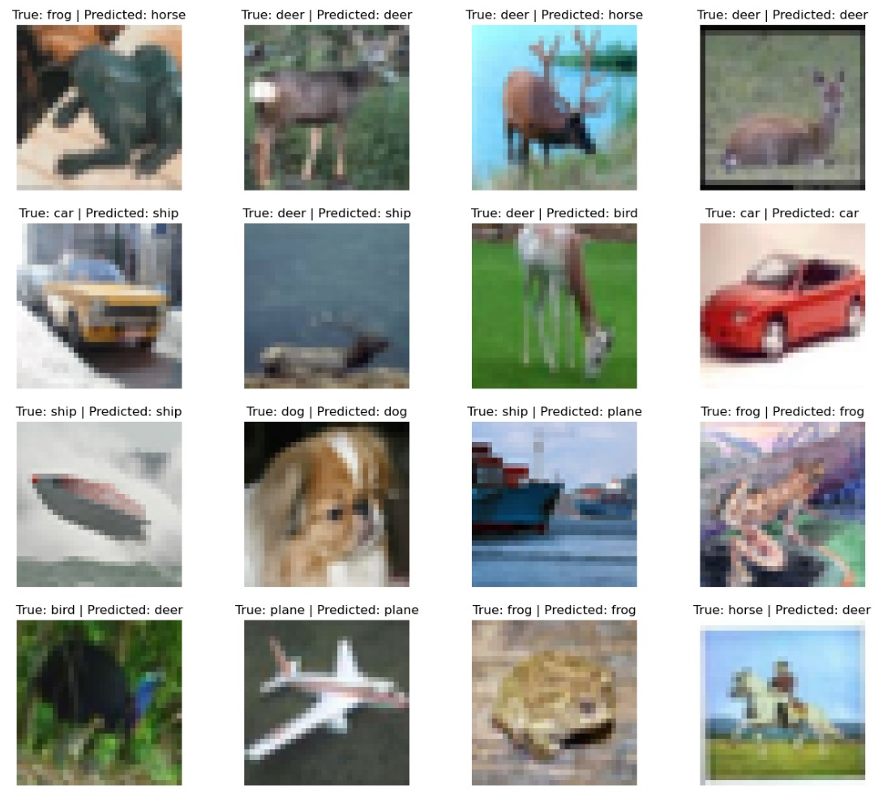

# ResNet

We implement ResNet-18 architecture from scratch using PyTorch. Implementation based off the original ResNet paper named "Deep Residual Learning for Image Recognition".

We implement the ResNet-18 architecture from scratch using PyTorch and trainied it on `CIFAR-10` dataset.

Implementation has been inspired from the original paper named "[Deep Residual Learning for Image Recognition](https://arxiv.org/pdf/1512.03385v1.pdf)".

